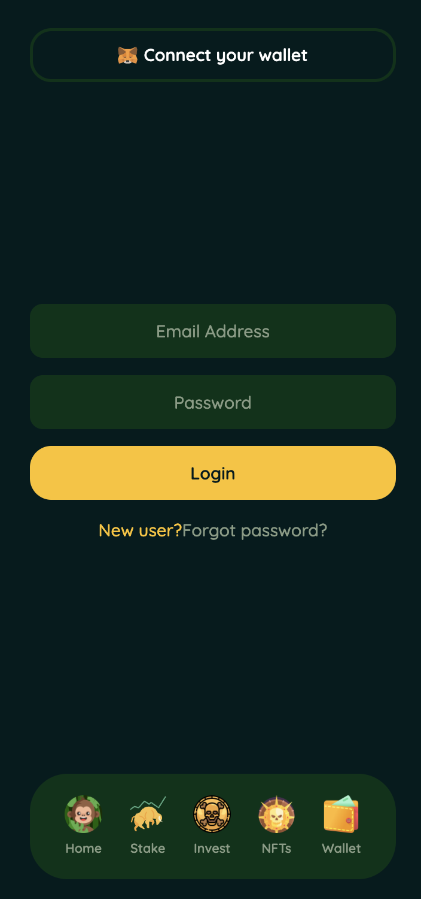
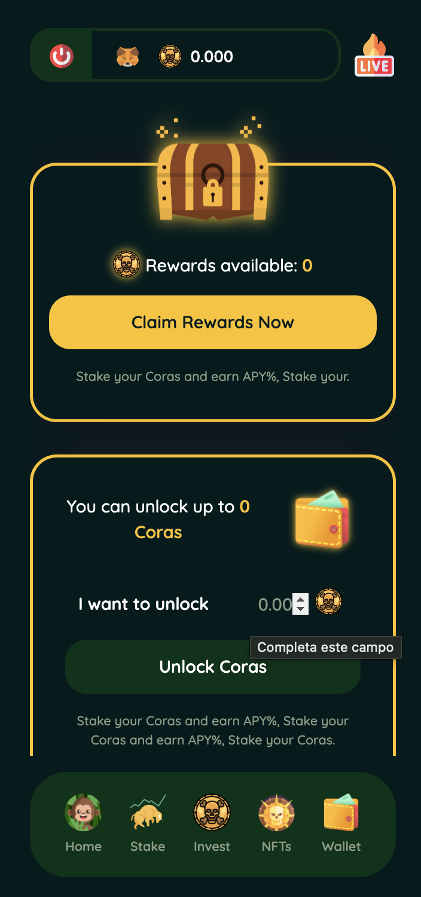
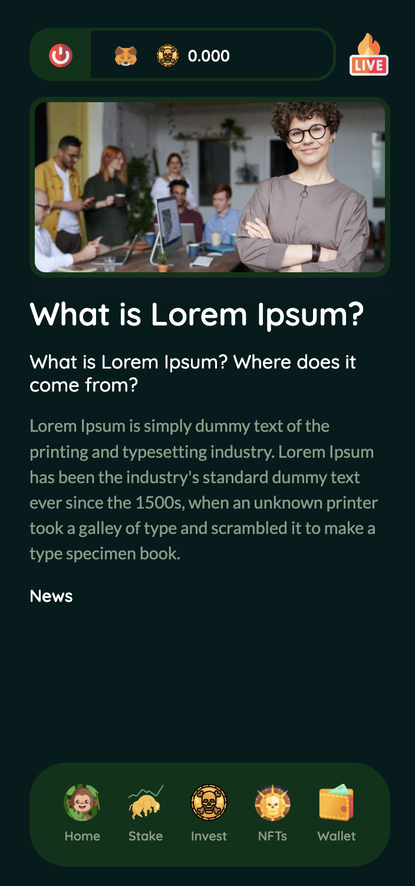

# 🪙⚡️ CoraToken-FrontEnd

# 📗 Table of contents
1. [What is this](#-what-is-this)
2. [Features](#%EF%B8%8F-features)
3. [How to install](#%EF%B8%8F-how-to-install)
4. [How to use](#%EF%B8%8F-how-to-use)
5. [Improvements Ideas](#-improvements-ideas)
6. [Screenshots](#%EF%B8%8F-screenshots)

## 🪙 What is this
- This is the front end of the coin CORA
- [Here](https://github.com/RolandoDrRobot/CoraToken-BackEnd) is the backend of the project
- [Here](https://github.com/RolandoDrRobot/CoraToken-Contracts) are the smart contracts for this project

## ⚡️ Features
- Login (Using a web2 backend (node + firebase)
- Mint NFTs
- Stake CORAS
- Send CORAS to other wallet
- Receive CORAS

## ⚙️ How to install

## ⚙️ How to use

## 📗 Improvements Ideas
- Replace the testing network (Rinkeby will be deprecated soon)
- Finish Invest functionality (Exchange USDC by CORAS)
- Update copys for all the windows

## ⚡️ Screenshots

